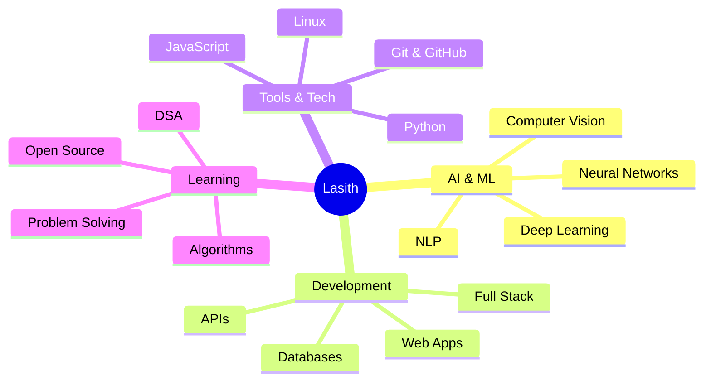

<div align="center">

# 👋 Hey! I'm Lasith

### AI Student | Photograph  | Nuture Lover | Developer


</div>

---

## 🚀 About Me

I'm an AI student passionate about technology, machine learning, and software development. Currently diving deep into the fundamentals while building projects that matter.

```python
class AIStudent:
    def __init__(self):
        self.name = "Lasith"
        self.year = "1st Year, 2st Semester"
        self.focus = ["Artificial Intelligence", "Machine Learning", "Full Stack Development"]
        self.current_status = "Learning and Building 🚀"
    
    def say_hello(self):
        print("Thanks for visiting my GitHub profile! Let's connect and build something amazing together!")

me = AIStudent()
me.say_hello()
```

---

## 🛠️ Tech Stack & Tools

<div align="center">

### 💻 Languages & Technologies

<table>
<tr>
<td align="center" width="96">

<br>JavaScript
</td>
<td align="center" width="96">

<br>Python
</td>
<td align="center" width="96">

<br>HTML5
</td>
<td align="center" width="96">

<br>CSS3
</td>
<td align="center" width="96">

<br>Java
</td>
</tr>
</table>

### 🧠 AI/ML & Tools

<table>
<tr>
<td align="center" width="96">

<br>TensorFlow
</td>
<td align="center" width="96">

<br>PyTorch
</td>
<td align="center" width="96">

<br>Jupyter
</td>
<td align="center" width="96">

<br>NumPy
</td>
<td align="center" width="96">

<br>Pandas
</td>
</tr>
</table>

### 🔧 Development Tools

<table>
<tr>
<td align="center" width="96">

<br>Git
</td>
<td align="center" width="96">

<br>GitHub
</td>
<td align="center" width="96">

<br>Linux
</td>
<td align="center" width="96">

<br>VS Code
</td>
<td align="center" width="96">

<br>Docker
</td>
</tr>
</table>

</div>

---

## 📊 GitHub Stats

<div align="center">


</div>

---

## 🏆 GitHub Trophies

<div align="center">


</div>

---

## 📈 Contribution Graph

<div align="center">


</div>

---

## 🎯 Current Focus

<div align="center">



</div>

- 🤖 Learning Machine Learning algorithms and Deep Learning
- 🌐 Building full-stack web applications
- 💡 Exploring AI applications in real-world problems
- 📚 Studying Data Structures and Algorithms
- 🔥 Contributing to open-source projects
- 🎓 Completing 1st Year, 1st Semester of AI degree

---

## 📫 Connect With Me

<div align="center">

[](https://github.com/Lasithwxn)
[](https://www.instagram.com/lasithwxn)
[](https://youtube.com/@lasithwxn)
[](mailto:your.email@gmail.com)
[](https://www.linkedin.com/in/lasithwxn/?skipRedirect=true)
</div>

---

## 💻 Weekly Development Breakdown

<!--START_SECTION:waka-->
```text
Python       8 hrs 42 mins   ████████████░░░░░░░░░   48.2%
JavaScript   4 hrs 15 mins   ██████░░░░░░░░░░░░░░░   23.6%
CSS          2 hrs 30 mins   ███░░░░░░░░░░░░░░░░░░   13.9%
HTML         1 hr 45 mins    ██░░░░░░░░░░░░░░░░░░░    9.7%
Other        0 hrs 50 mins   █░░░░░░░░░░░░░░░░░░░░    4.6%
```
<!--END_SECTION:waka-->

---

## 🌟 Featured Projects

<div align="center">
<a href="https://github.com/Lasithwxn/project1">
  
</a>
<a href="https://github.com/Lasithwxn/project2">
  
</a>
</div>
---

## 💭 Random Dev Quote

<div align="center">


</div>

---

## 🐍 Watch My Contributions Get Eaten!
<div align="center">

</div>
---

<div align="center">

### 💡 "The best way to predict the future is to invent it." - Alan Kay


### ⭐ From [Lasithwxn](https://github.com/Lasithwxn) with 💙


</div>
